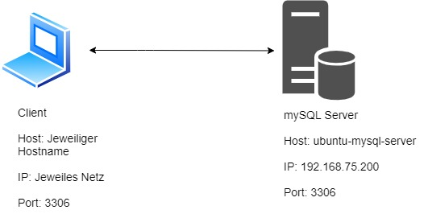

# 📖 LB2 Dokumentation - Mysql Server bei welchem die Datenbanken über PHPmyadmin erreichbar ist 📖

_Erstellt von [Benneth Gripp](https://github.com/1JustBen5) am 12.03.2021_

## Inhaltsverzeichnis
- [Grafische Übersicht](#Grafische-Übersicht) 
- [Einleitung](#Einleitung) 
- [Beschreibung](#Beschreibung) 
- [VM/Dienst starten](#VM/Dienst-starten) 
- [Auf Dienst/Service zugreifen](#Auf-Dienst/Service-zugreifen) 
- [Sicherheit](#Sicherheit) 
- [Tests](#Tests) 
- [Quellenangabe](#Quellenangabe) 

 

## Grafische Übersicht

 

## Einleitung
In der LB2 soll man einen Diesnt erstellen mit Vagrant, der nach dem 'vagrant up' direkt verfügbar ist. Ich habe mich dabei für einen mySQL-Server entschieden, bei dem die Datenbanken über phpMyAdmin direkt verfügbar sind.

 
